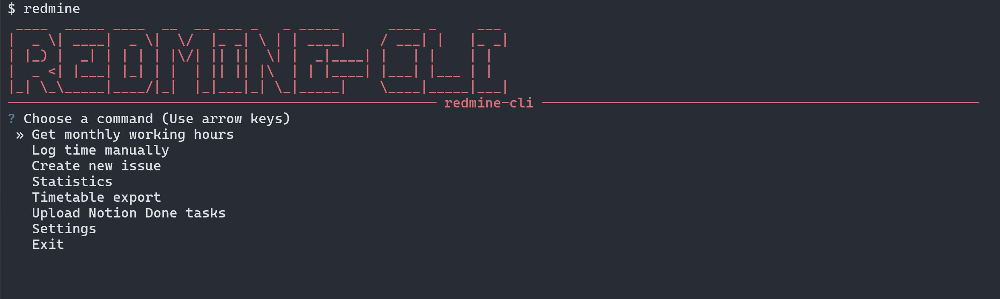

# redmine-cli

`redmine-cli` is a Windows-first Redmine utility that combines a keyboard-driven CLI/TUI with the original Excel-based GUI exporter.



The project covers three main workflows:

- inspect your Redmine hours and monthly work totals
- generate monthly timetable Excel and PDF files
- create Redmine issues and time entries manually or from Notion tasks

## Main Menu

When you launch `redmine`, the TUI command hub exposes these actions:

- `Get monthly working hours`
- `Log time manually`
- `Create new issue`
- `Statistics`
- `Timetable export`
- `Upload Notion Done tasks`
- `Settings`
- `Exit`

### Menu Items With Examples

#### Get monthly working hours

Use this when you want a quick monthly summary from Redmine.

Example:

```powershell
redmine hours
```

This shows daily totals for the selected month and can also display estimated earnings if `SALARY_PER_HOUR` is configured.

#### Log time manually

Use this when the Redmine issue already exists and you just want to add a new time entry.

Example:

```powershell
redmine log
```

Typical inputs:

- select project
- select issue
- enter hours and minutes
- choose activity
- add comment
- set spent date

#### Create new issue

Use this when the task is not yet in Redmine and you want to create it first.

Example:

```powershell
redmine issue new
```

You can create the issue directly under a project or descend through an issue tree and create it as a subtask. After creation, the app can immediately log time to it.

#### Statistics

Use this for overview and trend analysis.

Example:

```powershell
redmine stats
```

Available statistics include:

- monthly project distribution
- historical hours trend
- historical earnings trend

#### Timetable export

Use this to generate the monthly Excel and PDF timetable files.

Example:

```powershell
redmine timetable
```

This fetches the month's time entries, fills the template workbook, and exports the result to PDF.

#### Upload Notion Done tasks

Use this when completed tasks live in Notion and you want to turn them into Redmine issues and time entries.

Example:

```powershell
redmine upload
```

This flow can filter by project and `Work / Private`, then create Redmine issues, log time, and archive the processed Notion tasks.

#### Settings

Use this to edit the local `.env` without leaving the TUI.

Example:

```powershell
redmine settings
```

You can update Redmine, Notion, and salary-related settings from the menu.

#### Exit

Closes the TUI command hub.

## What It Can Do

### Redmine CLI / TUI

- open an interactive command hub with `redmine`
- show monthly working hours grouped by day
- estimate monthly earnings from configured hourly rate
- log time manually to an existing Redmine issue
- create a new Redmine issue in a project or under an existing parent issue
- immediately log time to the newly created issue
- browse monthly project distribution statistics
- browse historical hours and earnings trends
- edit local `.env` settings from the TUI
- run configuration diagnostics with `redmine config doctor`

### Timetable Export

- fetch Redmine time entries for a selected month
- fill the Excel timetable template automatically
- hide unused rows and calculate summary totals
- export the filled sheet to PDF through Excel automation
- optionally fall back to LibreOffice PDF export

### Notion Integration

- optionally disable Notion integration entirely with `NOTION_ENABLED`
- list Notion projects filtered by `Work / Private`
- pull `Done` tasks from a Notion tasks database
- filter tasks by project and status
- create Redmine issues from those tasks
- log spent time for each created issue
- archive uploaded Notion tasks and set `Done at`

### Original GUI

- run the legacy Windows GUI from `gui/main.py`
- build a standalone Windows executable with PyInstaller

## Project Structure

```text
.
|- bin/                 # global redmine command wrapper
|- cli/                 # Python CLI / TUI implementation
|  `- redmine_timetable_cli/
|- gui/                 # original GUI implementation and build scripts
|- .env.example         # example local configuration
|- package.json         # npm wrapper package
`- README.md
```

## Requirements

- Windows
- Node.js 18+ recommended
- Python 3.11+ recommended
- Microsoft Excel desktop app installed for the standard PDF export path

Excel is still the primary PDF/export path because the timetable flow automates the workbook template directly.

## Configuration

Create a local `.env` in the repository root based on `.env.example`.

### Core Redmine settings

Required for almost every workflow:

- `REDMINE_BASE_URL`
- `REDMINE_API_KEY`
- `REDMINE_USER_ID`

Useful optional Redmine settings:

- `DEFAULT_REDMINE_ACTIVITY_ID`
- `HTTP_USER_AGENT`
- `USE_CURL`

### Timetable/export settings

Optional, with built-in defaults:

- `EXCEL_IN`
- `EXCEL_OUT`
- `PDF_OUT`
- `SHEET_NAME`
- `ARRIVAL_TIME`
- `PRINT_AREA`
- `ALLOW_LIBREOFFICE_FALLBACK_ON_WINDOWS`

### Salary/statistics settings

Optional:

- `SALARY_PER_HOUR`
- `SALARY_CURRENCY`

### Notion settings

Required only if you use Notion-backed upload flows:

- `NOTION_ENABLED`
- `NOTION_API_TOKEN`
- `NOTION_TASKS_DATABASE_ID`
- `NOTION_PROJECTS_DATABASE_ID`

Useful optional Notion settings:

- `NOTION_PROJECT_NAMES`
- `NOTION_WORK_PRIVATE_SCOPE`
- `NOTION_DONE_STATUS_NAME`
- `NOTION_UPLOADED_FLAG_PROPERTY`
- `NOTION_REDMINE_ISSUE_PROPERTY`

Do not commit your real `.env`.

## Install The CLI

From the repository root:

```powershell
npm install
npm link
```

This exposes the global `redmine` command. The Node wrapper in `bin/redmine.js` bootstraps a local Python runtime into `.runtime` on first run and installs the CLI dependencies automatically.

If the repository folder or package name changes, run `npm link` again so the global shim points to the current checkout.

## Commands

You can launch the interactive hub:

```powershell
redmine
```

Or run commands directly:

```powershell
redmine hours
redmine log
redmine issue new
redmine stats
redmine timetable
redmine upload
redmine settings
redmine config doctor
redmine help
```

### Command Summary

- `redmine`: opens the main interactive menu
- `redmine hours`: shows daily totals for a selected month and optional salary estimate
- `redmine log`: logs a manual time entry onto an existing Redmine issue
- `redmine issue new`: creates a Redmine issue and can immediately log time to it
- `redmine stats`: shows monthly project distribution or historical hours/earnings trends
- `redmine timetable`: generates filled Excel and PDF timetable output
- `redmine upload`: imports eligible Notion tasks and creates Redmine issues/time entries
- `redmine settings`: edits supported `.env` values from the TUI
- `redmine config doctor`: prints workspace and configuration diagnostics
- `redmine help`: prints the available command list

Recommended first check:

```powershell
redmine config doctor
```

## Typical Workflows

### 1. Check hours for a month

```powershell
redmine hours
```

Select a month, review per-day totals, and optionally see estimated earnings if `SALARY_PER_HOUR` is configured.

### 2. Create a timetable export

```powershell
redmine timetable
```

Select a month, choose output file names, and the tool will create:

- a filled Excel workbook
- a PDF export of the selected worksheet

### 3. Log time manually

```powershell
redmine log
```

The flow lets you choose:

- Redmine project
- issue
- hours and minutes
- activity
- comment
- spent date

### 4. Create a new issue

```powershell
redmine issue new
```

You can create the issue:

- directly under the chosen Redmine project
- or under an existing issue as a subtask

After creation, the app can immediately create a time entry on that issue.

### 5. Upload completed Notion tasks

```powershell
redmine upload
```

The flow can:

- filter Notion tasks by project
- filter by `Work / Private`
- create matching Redmine issues
- log time to each created issue
- archive the processed Notion tasks

## GUI Development

To run the original GUI directly:

```powershell
python -m venv gui\venv
.\gui\venv\Scripts\python -m pip install -r gui\requirements.txt
.\gui\venv\Scripts\python gui\main.py
```

The GUI source and assets live under `gui/`.

## Build The GUI

To build the Windows executable:

```powershell
python -m venv gui\venv
.\gui\venv\Scripts\python -m pip install -r gui\requirements.txt
.\gui\venv\Scripts\python -m pip install pyinstaller
.\gui\build.bat
```

The build output is generated under `gui\dist\redmine-cli`.

## Notes

- `gui\unfilled.xlsx` must remain in the repository because timetable generation depends on it.
- `redmine upload` requires that the Notion integration has access to the configured Tasks and Projects databases.
- `redmine settings` writes directly into the local `.env`.
- After cloning on a new machine, or after renaming/moving the repo folder, run `npm link` again.
